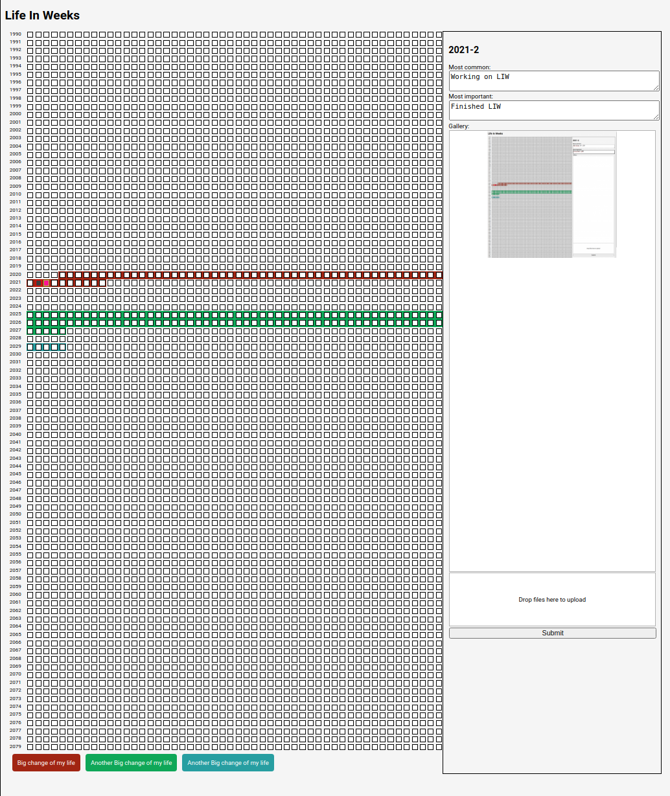

# Life In Weeks

Simple LIW implementation.
The application allows insert the most common and the most important event of the week which should not be forgotten.
It includes simple photo gallery for each week. 

The application is built on top of PHP and JavaScript. Data is stored to json files. Uploaded images are optimized.

Dockerized development PHP server is bundled in this repository. 
So, for code improving it is possible to use it (docker-compose up --build)

TODO: 
- add security
- add webP conversion support
- image preloading
- default year
- multiuser support

